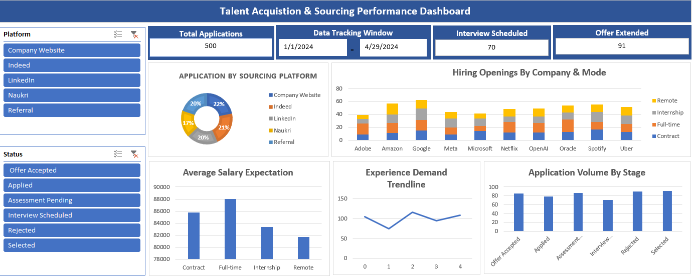
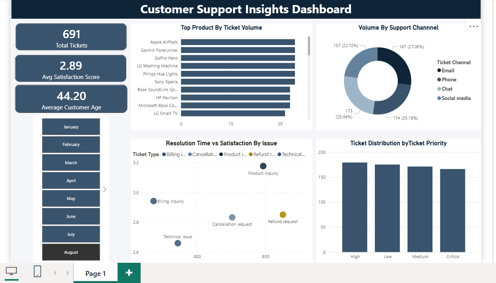

# Data-Analytics-Portfolio
Welcome to my portfolio! Below are the details and interactive breakdowns of the analytics project i have built.
----
## 1. Talent acquistion & Sourcing Performance Dashboard
A comprehensive Excel dashboard tracking recruitment pipelines, salry benchmarks and hiring efficiency corporate modes.
* [view project folder] (./Excel-Project/)
### Dasboard Preview

## 2. Customer Support Insights Dashboard (Power Bi)
A dynamic Power BI workspace measuring critical support KPIs, response intervals, and product volume trends.
* [View project folder] (./Power-BI-Project/)

